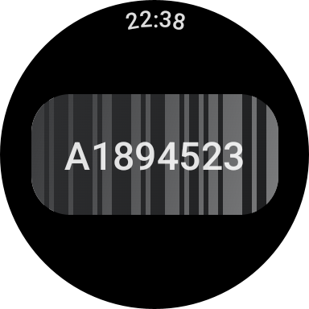
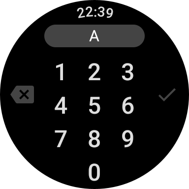

# Parkrun ID

### Overview

Parkrun ID is a small app to help configure a [Wear OS Tile][tiles] to quickly
show your [Parkrun][parkrun] barcode / QR code at the end of your run, with a
single swipe.

### Setup

Once the app is built and installed, tap the main button to enter your Parkrun
ID. This can be found on your athlete page or your barcode printout, and starts
with an "A", for example, **A123456**.

Then return to the watch face and swipe left to show the first Tile
**Tile Carousel**.

Long-press on the first Tile to configure the carousel, and add the Parkrun
Tile.

### Privacy policy

This app does not collect any data of any kind. Your Parkrun ID is stored in the app, to allow display of the QR code / barcode but is not shared with any other app nor transmitted from the device.

[tiles]: https://developer.android.com/codelabs/wear-tiles
[parkrun]: https://www.parkrun.org.uk/